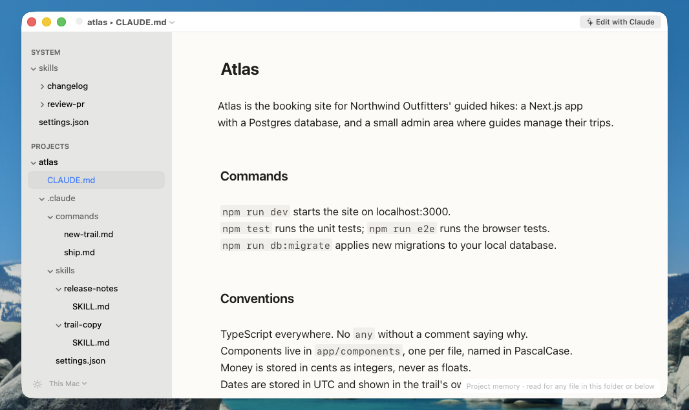
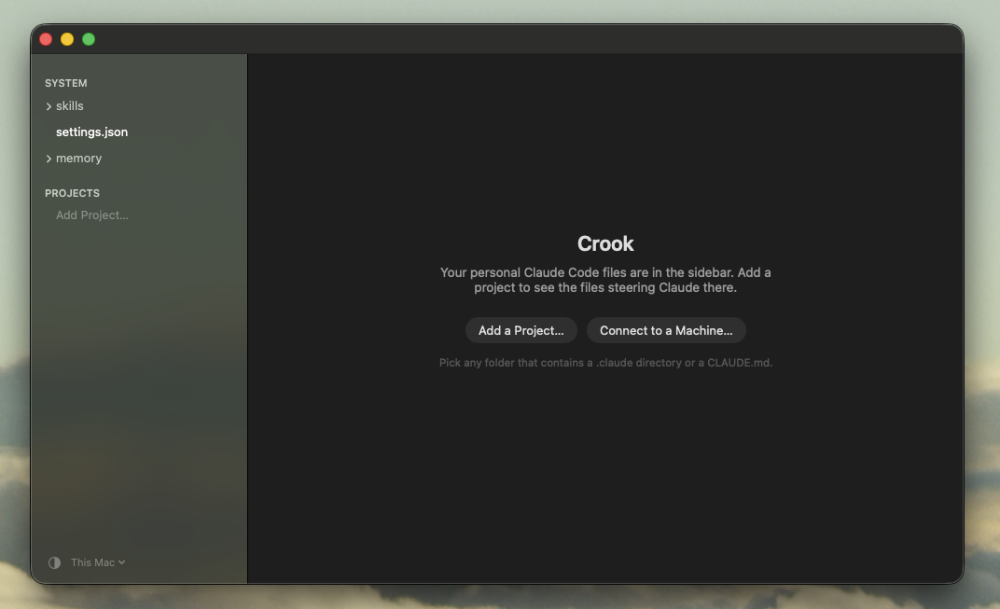
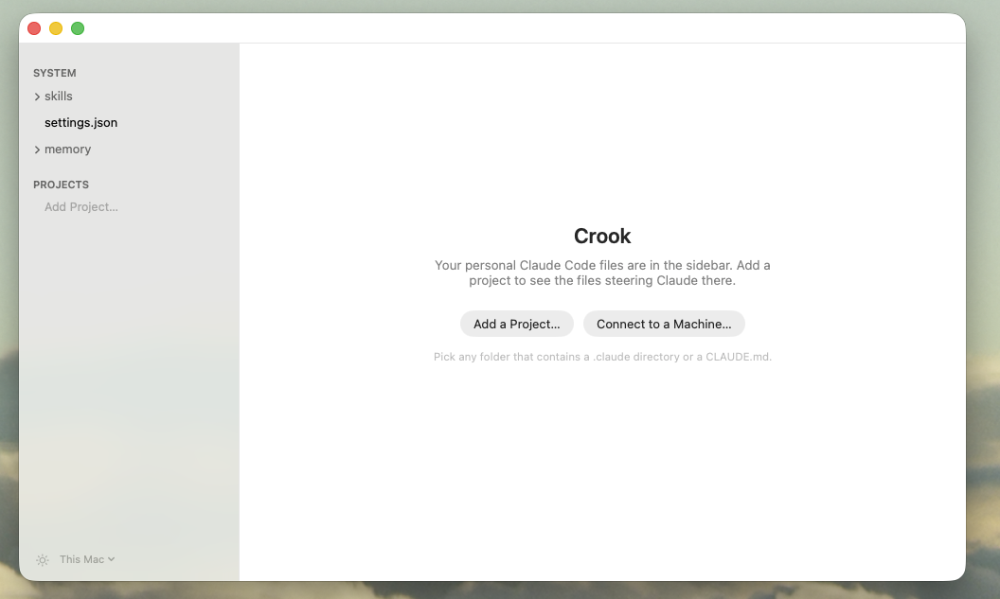
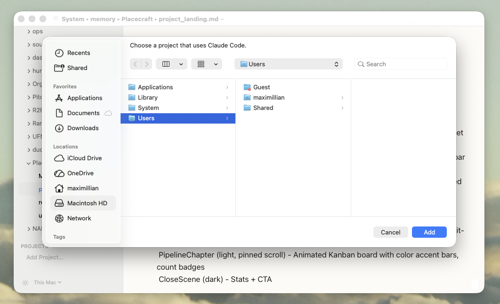

# Crook

**A quiet editor for the files that steer Claude Code.**

Skills, `CLAUDE.md`, slash commands, subagents, memory notes — the files that
decide how Claude behaves in your projects. Crook shows you all of them in one
place, tells you which ones Claude actually reads, and shows you what changed
when Claude rewrites them behind your back.



A crook is the hooked staff a shepherd uses to steer the flock. These files are
how you steer yours.

Requires **macOS 26** or later on an Apple Silicon Mac.

---

## Install

1. Download `Crook-x.y.z.zip` from [Releases](../../releases/latest).
2. Unzip it and drag **Crook** into your Applications folder.
3. **First launch only:** double-click it. macOS will say it can't check Crook
   for malware. That's because it isn't notarised — notarising costs an Apple
   developer account, and this is a small free tool. Open **System Settings ▸
   Privacy & Security**, scroll to the bottom, click **Open Anyway** next to
   the message about Crook, and confirm.

You do that once. After that it opens like anything else.

If you'd rather not run a stranger's binary — reasonable — [build it
yourself](#building). It takes about a minute.

---

## Using it

### First launch

Your personal Claude Code files are already in the sidebar: the skills,
`settings.json` and memory notes from `~/.claude`. Nothing else appears until
you add it.



Two ways in. **Add a Project…** for a folder on this Mac; **Connect to a
Machine…** for a folder on another one. The sun/moon in the bottom-left switches
between light, dark, and follow-the-system.



### Adding a project

Click **Add a Project…** and pick any folder that has a `.claude` directory or
a `CLAUDE.md` in it. Crook never scans your disk and never adds anything you
didn't choose.



### Editing

Click a file and it opens. Markdown renders as you type — headings, code,
emphasis — with no preview pane and no mode to switch. `⌘S` saves.

The screenshot at the top shows the three things worth knowing:

- **The tree is only what Claude reads.** `CLAUDE.md`, then `.claude/` with its
  `commands`, `skills` and `settings.json`. Not a file browser: vendored
  `node_modules` skills and session transcripts never appear.
- **The line in the bottom-right says why Claude reads this file.** Here it's
  *Project memory · read for any file in this folder or below*. For a skill it
  might be *Personal skill · /release-notes*, or *Not in a directory Claude Code
  scans for skills* — the one that saves you an afternoon. It updates as you
  type: add `disable-model-invocation: true` to a skill and the sentence
  changes on the keystroke that completes it.
- **Files Claude changed while you were away carry a count in the sidebar** —
  `+7`, `−12`. Open one and Crook shows you what moved before you carry on.
  It's a viewer, not a merge tool: the file on disk is the file.

Crook also underlines a path that no longer exists — a slash command pointing
at a folder you renamed looks fine and does nothing — and says where the path
stops being real.

### It never changes a byte you didn't

Line endings, trailing whitespace, a missing final newline, indent style — all
preserved exactly. These files are read by a machine, so a diff you didn't
author is not cosmetic noise. macOS smart quotes and dash substitution are
turned off inside Crook for the same reason. Crook also writes nothing into
your projects — no dotfiles, no sidecars, no index.

### Keyboard

| | |
|---|---|
| `⌘O` | Open a file |
| `⌘S` | Save |
| `⌘R` | Reload from disk, discarding your edits |
| `⌘D` | Show what changed since you last opened this file |
| `⇧⌘E` | Edit with Claude |
| `⌥⇧⌘E` | Edit with Claude, skipping the question |
| `⌘+` `⌘−` `⌘0` | Bigger, smaller, actual size |

### Editing with Claude

Some changes are easier to describe than to make: rename something that
appears in a dozen places, turn a section into a checklist, tighten a skill's
description. Click **Edit with Claude** at the top right of the window, or
press `⇧⌘E`.

Say what you want in the box that appears — or leave it empty — and press
Return. Crook opens Claude Code in Terminal, beside this window, already in the
right folder and already told which file you mean. If you selected some lines
first, it knows those too. Talk to Claude there. Every change it saves shows
up in Crook straight away, highlighted.

While Claude has the file it's read-only in Crook, so the two of you never type
over each other. When you're done, type `/exit` in Terminal, or click **End
Session** in Crook to get editing back straight away. Crook comes back to the
front and says what changed: **Review Changes** shows the diff, and **Undo
Changes** puts this file back exactly as it was before Claude started. Undo
covers only this file — other files you let Claude change stay changed — and
it stays on offer until you click **Done** or type in the file.

You need [Claude Code](https://code.claude.com/docs/en/setup) installed and a
Claude account; the first time, Claude Code asks you to log in. Crook tells you
if it isn't installed. The first time you use it in a folder, Claude Code asks
whether you trust that folder; choose **Yes, I trust this folder**. For a file
on another Mac, Claude runs on that Mac, over the connection Crook already has,
so Claude Code needs to be installed on that Mac.

Claude can change most files without asking. Files inside a `.claude` folder —
skills, commands, agents — are different: Claude Code always asks before it
changes one, so answer **Yes** in Terminal. If a change needs other files too,
Claude asks you before it touches them.

---

## Working on another Mac

If Claude Code runs on a machine you reach over SSH — a headless Mac mini on
Tailscale, say — Crook can edit that machine's files as if they were local.
Same tree, same reach line, same change marks. One window is one machine; the
one you're looking at is named in the bottom-left of the sidebar, and in the
window's subtitle when it isn't this Mac.

### Setup

One thing has to be true on the far machine: **System Settings ▸ General ▸
Sharing ▸ Remote Login**, switched on. That's the whole setup. Crook runs the
system `ssh` and adds nothing of its own, so if that machine works from a
terminal it works here.

### Connecting

Click **Connect to a Machine…** and type the name you'd use with `ssh`. The
field already lists machines you've used and every `Host` alias in your
`~/.ssh/config`, so usually the answer is there to pick.

On first connect Crook copies a small helper (~250 KB) to `~/.crook/` on that
machine and runs it over the SSH session. Nothing to install by hand, nothing
listening on a port, nothing left running when you disconnect.

**You don't need SSH keys.** If the far Mac asks for a password — which is what
a Mac with Remote Login freshly switched on does — Crook asks you for it and
says plainly that it means your login password on that machine. If you use a
key with a passphrase, it asks for that instead. Either way it asks only when
`ssh` says it needs to, hands the answer to `ssh` through a pipe rather than a
file, never writes it to disk, and doesn't remember it. The next connection
asks again.

If it can't connect, the message says which end to look at: a name that won't
resolve is a different problem from a Mac that's refusing SSH, and Crook names
the Remote Login switch rather than repeating ssh's "connection refused". If
it times out and the machine is definitely up, check whether a VPN on *this*
Mac is capturing the route — a commercial VPN running alongside Tailscale will
do exactly that.

### Adding a project on that machine

**Add Project…** while connected shows the folders Claude Code has already
worked in over there. It isn't a file browser — there's no disk to browse — and
it only offers real projects. If a folder you expect is missing, Claude Code
hasn't run in it yet: open a terminal on that machine, `cd` into the folder,
run `claude` once, and it appears.

### Why not just mount the disk?

Because mounting gets two things wrong that can't be fixed. Paths inside your
files get checked against the *wrong* machine, so live links read as broken,
and no mounted filesystem can report a change another host made — which is the
whole point of the change marks. The helper on the far side answers both
correctly.

### A tip for people who keep a terminal open to that machine anyway

```
Host mac-mini
  ControlMaster auto
  ControlPath ~/.ssh/cm-%r@%h:%p
  ControlPersist 10m
```

in `~/.ssh/config` lets Crook share a connection that's already open instead of
building its own — no second handshake, no second authentication.

---

## Building

You need Xcode 26 (for the macOS 26 SDK) and Node 20 or later.

```sh
git clone <this repo>
cd crook
cd web && npm ci && cd ..
./scripts/build.sh          # → build/Crook.app
open build/Crook.app
```

Tests:

```sh
./scripts/test.sh           # everything
./scripts/test.sh bytes     # one suite
```

To cut a release artifact:

```sh
./scripts/release.sh        # → dist/Crook-x.y.z.zip
```

There's no `.xcodeproj`. The app is built by `swiftc` from a shell script,
which is short enough to read and does exactly what it says.

If you build from a folder that syncs to iCloud Drive (the default Desktop and
Documents do), iCloud stamps the freshly built bundle with an attribute that
breaks its signature check. The build script works around it; if you ever see
a signing failure that makes no sense, that's why, and building from a folder
outside iCloud makes it go away for good.

---

## How it's put together

An AppKit shell hosting a `WKWebView` that runs CodeMirror 6.

The unusual choice is that **Swift owns the text**, not CodeMirror. The buffer
lives in an `NSMutableString`, UTF-16 indexed, LF-only; CodeMirror sends change
sets across per animation frame and is never handed the whole document except
at load. That's what makes byte-exact round-trips possible — the editor is a
view, and nothing re-serialises the file on save.

Markdown renders live, Typora-style: syntax marks hide as you type and reappear
when the caret enters the block. AppKit owns every control; the web view
contains none, in any state.

Every filesystem call goes through one small protocol with two implementations,
local and SSH-backed, which is what lets the same code serve both machines. The
remote half is tested against the real helper binary over a pipe — including
the whole fixture corpus read back byte-for-byte — so it doesn't need a second
Mac to verify.

---

## Licence

MIT — see [LICENSE](LICENSE). Bundled dependencies are listed in
[THIRD-PARTY.md](THIRD-PARTY.md).
